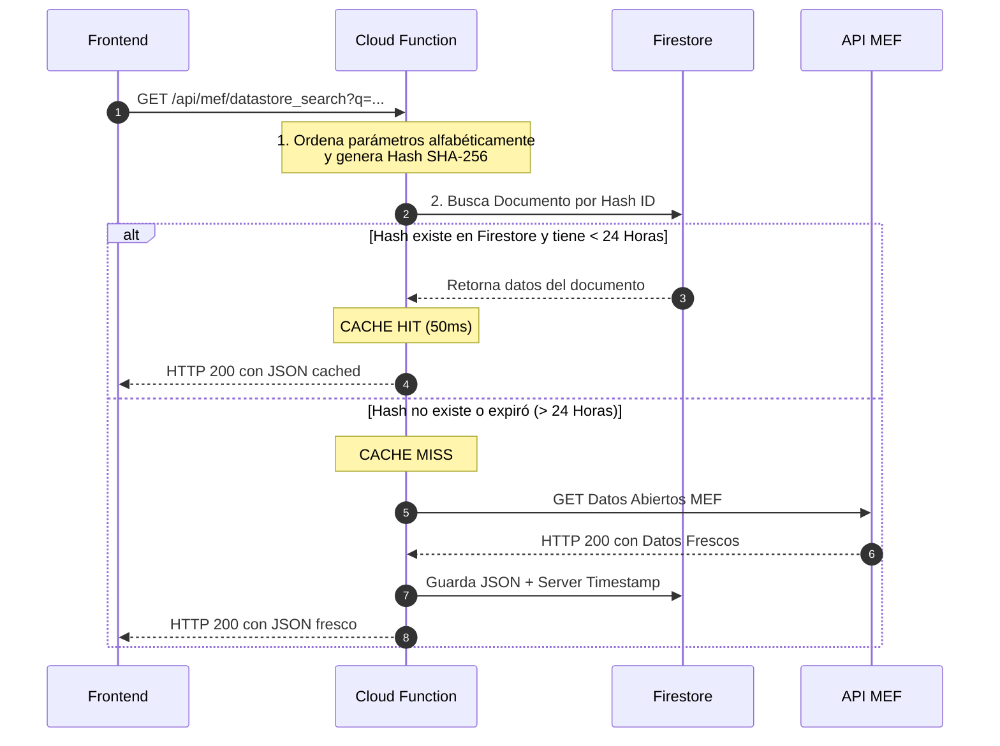

# Documentación Técnica: Cloud Functions y Patrón BFF (Backend-For-Frontend)

Este documento detalla el diseño de la capa lógica intermedia de **ExpedienteCheck**, explicando el rol de la Cloud Function (`mefProxy`), la implementación de la caché con Firestore, el patrón de diseño BFF y cómo interactúan las distintas capas del sistema.

---

## 🧠 ¿Qué es el Patrón BFF (Backend-For-Frontend)?

El **Backend-For-Frontend (BFF)** es un patrón de diseño arquitectónico en el que se construye un backend dedicado exclusivamente a actuar como intermediario para una interfaz de usuario (frontend) específica. 

```
┌──────────────┐         Petición HTTP         ┌────────────────────┐         Consulta HTTP         ┌──────────────┐
│  FRONTEND    │ ────────────────────────────> │     BFF PROXY      │ ────────────────────────────> │   API MEF    │
│  (Cliente)   │ <──────────────────────────── │  (Cloud Function)  │ <──────────────────────────── │  (Externo)   │
└──────────────┘           Respuesta           └─────────┬──────────┘           Respuesta           └──────────────┘
                                                         │
                                               Consulta  │  Escritura
                                               y Lectura │  de Caché
                                                         ▼
                                               ┌────────────────────┐
                                               │     FIRESTORE      │
                                               │  (Base de Datos)   │
                                               └────────────────────┘
```

### ¿Por qué lo implementamos en este proyecto?
1. **Resolución de CORS:** Las API gubernamentales del MEF no permiten peticiones directas desde navegadores de otros dominios (como `localhost` o la URL del hosting de desarrollo). El BFF al ser un servidor intermedio realiza la petición HTTP "servidor a servidor" (donde no aplica CORS) y le devuelve los datos al frontend inyectando las cabeceras HTTP de origen cruzado necesarias.
2. **Capa de Abstracción y Seguridad:** El frontend no conoce la URL real del MEF ni las cabeceras de cabecera que la API requiere. Además, el BFF valida y filtra los endpoints permitidos (`datastore_search` y `datastore_search_sql`), bloqueando cualquier consulta maliciosa que intente atacar el backend del MEF.
3. **Resiliencia ante Inestabilidad:** El portal de datos abiertos del MEF experimenta caídas constantes y errores HTTP 500. El BFF implementa una lógica de contingencia: si la API externa falla pero el dato fue consultado previamente, el sistema sigue funcionando sirviendo la información histórica.

---

## 🛠️ ¿Qué hace exactamente la Cloud Function (`mefProxy`)?

La Cloud Function [functions/index.js](file:///d:/Data-Analytic-Proyect/expedientecheck-reto/functions/index.js) es un servicio serverless de segunda generación (v2) configurado bajo las siguientes especificaciones técnicas:
* **Ubicación:** Servido en la región `southamerica-east1` (São Paulo) para reducir la latencia de red con respecto a los usuarios en Perú.
* **Recursos:** Cuenta con un límite de memoria de `256MiB` y escalabilidad horizontal de hasta 10 instancias simultáneas.
* **Timeout:** Su tiempo máximo de espera es de `300 segundos` (5 minutos) para tolerar las consultas complejas sobre millones de registros del MEF que pueden tardar más de 40 segundos en responder.

### Flujo de Ejecución y Caché de 24 Horas
Cuando entra una petición GET al proxy:



1. **Generación de Firma de Caché (Hash SHA-256):** 
   La función ordena alfabéticamente los parámetros recibidos en la URL antes de aplicar el algoritmo criptográfico. Esto garantiza que la URL `?año=2024&mes=5` y la URL `?mes=5&año=2024` produzcan el mismo hash SHA-256 y compartan la misma caché.
2. **Consulta a Firestore (Admin SDK):**
   Busca en la colección `mef_cache` el documento con el ID del hash generado. Si el documento existe y su marca de tiempo (`createdAt`) tiene una antigüedad menor a **24 horas** (`CACHE_TTL`), se retorna la data directamente desde Firestore. Esto reduce el tiempo de respuesta de **40,000ms a escasos 50ms**.
3. **Petición HTTP de Respaldo (node-fetch):**
   Si no hay caché disponible, el BFF realiza la llamada HTTP a la API de datos abiertos del MEF. Al recibir un estado exitoso (`jsonResponse.success === true`), guarda la respuesta completa en Firestore usando la función de base de datos `FieldValue.serverTimestamp()` y devuelve los datos frescos al cliente.

---

## 🔗 ¿Cómo se comunica con los componentes del Sistema?

### 1. Comunicación con el Frontend (Vite + Vanilla JS)
* **El Puente (Reescrituras en firebase.json):** 
  En [firebase.json](file:///d:/Data-Analytic-Proyect/expedientecheck-reto/firebase.json), configuramos una regla de reescritura de URL:
  ```json
  "rewrites": [
    {
      "source": "/api/mef/**",
      "function": "mefProxy"
    }
  ]
  ```
  Esto significa que el frontend no necesita apuntar a una URL externa compleja de Google Cloud Functions. Consulta directamente a la misma ruta relativa `/api/mef/` de su propio servidor. El balanceador de carga de Firebase Hosting intercepta la ruta y la desvía automáticamente a la Cloud Function de forma transparente para el navegador.
* **El Cliente API (mefClient.js):** 
  En el frontend, el módulo [frontend/src/api/mefClient.js](file:///d:/Data-Analytic-Proyect/expedientecheck-reto/frontend/src/api/mefClient.js) encapsula las llamadas HTTP usando `fetch` apuntando a `/api/mef/...`, estructurando las sentencias SQL y manejando los tiempos de espera del cliente (`AbortController` ajustado a 130 segundos).

### 2. Comunicación con Firebase (Firestore)
* **SDK de Administración (firebase-admin):**
  A diferencia del frontend (que se comunica por WebSockets que pueden ser bloqueados por AdBlockers), la Cloud Function se ejecuta dentro del perímetro seguro de Google. Utiliza el SDK de administración `firebase-admin`, lo que le da acceso directo a Firestore mediante el protocolo gRPC interno de Google con latencia ultra baja.
* **Caché centralizada:**
  La colección `mef_cache` sirve como almacén compartido. Si el "Usuario A" realiza una búsqueda compleja y esta se guarda en caché, cuando el "Usuario B" realice la misma búsqueda, se beneficiará instantáneamente de los datos pre-guardados en Firestore.

### 3. Comunicación con Terraform
* **Habilitación de Recursos:**
  Terraform declara que el proyecto necesita soporte para Cloud Functions y compilación en la nube activando las APIs de servicios de Google Cloud:
  ```terraform
  resource "google_project_service" "cloudfunctions_api" { ... }
  resource "google_project_service" "cloudbuild_api" { ... }
  ```
  Esto asegura que cuando Firebase CLI intente subir el código JavaScript de la función, Google Cloud tenga los servidores y compiladores listos para empaquetar la función en un contenedor e inicializarla.

