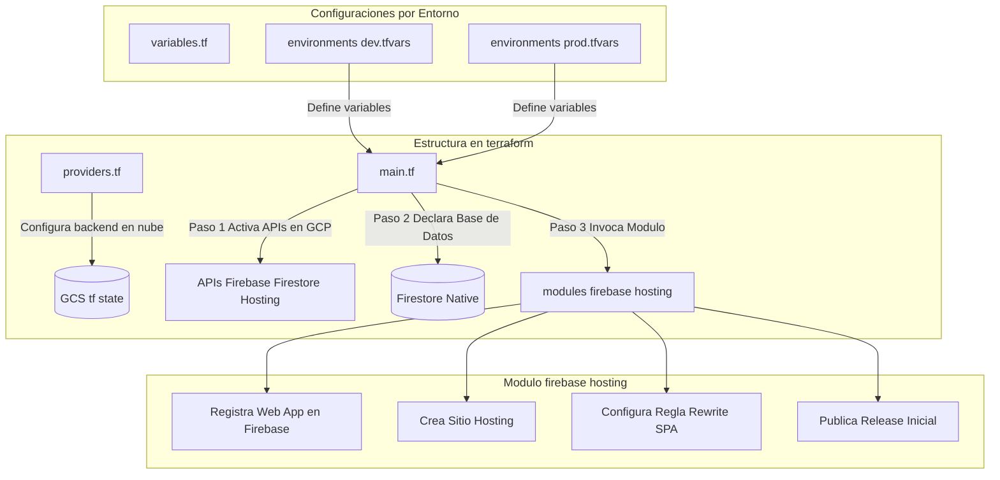

# Documentación Técnica: Terraform e Infraestructura como Código (IaC)

Este documento sirve como manual de arquitectura y configuración de infraestructura del proyecto **ExpedienteCheck**. Está diseñado para explicar de manera clara y con alto criterio técnico cómo se estructuró la infraestructura, por qué se tomaron ciertas decisiones de diseño y cómo se conecta con el ciclo de vida del software (despliegue continuo).

---

## 📋 Ficha de Conceptos Clave

### 1. ¿Qué es Terraform?
Terraform es una herramienta de **Infraestructura como Código (IaC)** declarativa de código abierto, desarrollada por HashiCorp. 
* **Declarativa:** Significa que nosotros le describimos a Terraform el "estado final" que deseamos para nuestros servidores (ej: *"Quiero una base de datos Firestore y una App de Firebase Hosting"*), y Terraform se encarga de calcular qué APIs llamar y en qué orden para construir ese estado exacto. No tenemos que programar los pasos de creación uno a uno.
* **El Proveedor (Provider):** Terraform interactúa con proveedores de nube mediante conectores. En nuestro caso, usamos el proveedor oficial `google-beta` de HashiCorp, imprescindible para aprovisionar características específicas de Firebase en Google Cloud Platform (GCP).
* **El Estado (`terraform.tfstate`):** Es el cerebro de Terraform. Es un archivo JSON que mapea la configuración de nuestro código con los recursos reales creados en la consola de Google Cloud. Le dice a Terraform: *"Esta línea de código representa a la base de datos ID X en GCP"*.

---

## 🏗️ ¿Cómo está Implementado en el Proyecto?

La infraestructura de **ExpedienteCheck** está organizada bajo principios de modularidad y escalabilidad en la carpeta `terraform/`.



### 1. Activación de APIs (El Cimiento)
Antes de crear cualquier recurso de Firebase en un proyecto de GCP vacío, las APIs correspondientes deben estar habilitadas. En [terraform/main.tf](file:///d:/Data-Analytic-Proyect/expedientecheck-reto/terraform/main.tf), Terraform se encarga de habilitar de forma automática y secuencial:
* `firebase.googleapis.com` (Firebase Core)
* `firestore.googleapis.com` (Base de datos NoSQL)
* `firebasehosting.googleapis.com` (Alojamiento web)
* `cloudfunctions.googleapis.com` (Backend Proxy)
* `cloudbuild.googleapis.com` (Compilación de funciones en la nube)

### 2. Base de Datos en Modo Nativo
Se aprovisiona la base de datos Firestore utilizando la especificación `FIRESTORE_NATIVE` en la región configurada (generalmente `us-central1` o la más cercana) para alojar el caché de la API del MEF y la persistencia de Favoritos.

### 3. Aprovisionamiento por Módulos
Para no duplicar código, encapsulamos la lógica de Firebase Hosting dentro de un módulo local reutilizable ([terraform/modules/firebase-hosting](file:///d:/Data-Analytic-Proyect/expedientecheck-reto/terraform/modules/firebase-hosting/main.tf)):
1. **Vinculación:** Une el proyecto GCP con el SDK de Firebase (`google_firebase_project`).
2. **Aplicación Web:** Registra la Web App para obtener las credenciales del frontend (`google_firebase_web_app`).
3. **Sitio de Alojamiento:** Define el identificador del sitio web que determinará su subdominio público (`google_firebase_hosting_site`).
4. **Configuración SPA:** Configura una regla de reescritura de URL (`rewrite`) para redireccionar todas las rutas (`**`) hacia `/index.html` (`google_firebase_hosting_version`). Esto permite que el enrutador del frontend (en el lado del cliente) funcione de forma fluida sin lanzar errores HTTP 404 al recargar una subruta.
5. **Liberación:** Lanza la versión inicial para habilitar la URL pública (`google_firebase_hosting_release`).

---

## 🧠 ¿Por qué se Implementó Así? (Criterio Técnico y Buenas Prácticas)

A continuación, se detallan las decisiones maduras de ingeniería de software aplicadas en este proyecto y las explicaciones clave de nuestro diseño de infraestructura:

### A. Estado Remoto Seguro con Backend GCS
* **Decisión:** Al inicio, el estado de Terraform se guardaba localmente en la máquina del desarrollador (`terraform.tfstate`). Migramos este comportamiento configurando un Backend remoto de **Google Cloud Storage (GCS)** con versionamiento habilitado en el bucket `expedientecheck-tf-state` (ver [providers.tf](file:///d:/Data-Analytic-Proyect/expedientecheck-reto/terraform/providers.tf)).
* **Por qué:** 
  1. **Colaboración:** Permite que múltiples desarrolladores o servidores de CI/CD apliquen cambios en la infraestructura sobre una única fuente de verdad sin pisarse mutuamente.
  2. **Seguridad y Resiliencia:** Si la computadora del desarrollador falla, el estado no se pierde. Al activar versionamiento en el bucket GCS, podemos revertir el estado ante cualquier corrupción accidental.

### B. Parametrización con `.tfvars` para Multientorno (DEV / PROD)
* **Decisión:** Separar la definición de infraestructura de los valores específicos de cada entorno usando variables en la carpeta `environments/` (con los archivos `dev.tfvars` y `prod.tfvars`).
* **Por qué:** Evita el antipatrón de duplicar código de infraestructura. El mismo código Terraform se ejecuta para crear el entorno de Desarrollo (DEV) y de Producción (PROD). Solo se inyectan variables diferentes (como nombres de proyecto, regiones y nombres de subdominios). Esto garantiza que DEV y PROD sean arquitectónicamente **idénticos**, previniendo sorpresas de comportamiento en producción.

### C. Configuración de API con `disable_on_destroy = false`
* **Decisión:** Todos los recursos de habilitación de APIs de GCP (`google_project_service`) llevan la bandera `disable_on_destroy = false`.
* **Por qué:** Si en algún momento ejecutamos `terraform destroy` para limpiar recursos y reducir costos, no queremos apagar las APIs globales de GCP del proyecto. Apagar una API en producción podría tardar minutos en revertirse, interrumpir servicios compartidos o borrar metadatos de cuotas históricas del proyecto.

---

## 🔗 ¿Cómo se Conecta con el Despliegue de la Aplicación? (CI/CD)

Existe una **separación clara de responsabilidades (Separation of Concerns)** entre Terraform y Firebase CLI / GitHub Actions. 

```
┌─────────────────────────────────────────────────────────────┐
│                   1. APROVISIONAMIENTO (Terraform)           │
│  "Crea la estructura física del edificio"                     │
│  - Habilita APIs de Google Cloud                            │
│  - Reserva el subdominio de Hosting                         │
│  - Activa la Base de Datos Firestore                        │
│  - Crea los registros de Aplicación Web                     │
└──────────────────────────────┬──────────────────────────────┘
                               │
                               ▼
┌─────────────────────────────────────────────────────────────┐
│               2. DESPLIEGUE DE CÓDIGO (GitHub Actions)       │
│  "Amuebla y decora el edificio"                              │
│  - Corre pruebas automatizadas unitarias (Vitest)           │
│  - Compila el Bundle Frontend (Vite)                        │
│  - Despliega la lógica JavaScript (Cloud Functions)         │
│  - Aplica reglas de seguridad a la BD (firestore.rules)     │
└─────────────────────────────────────────────────────────────┘
```

El puente de conexión entre ambas herramientas ocurre de la siguiente manera:

1. **Definición de Targets (.firebaserc y firebase.json):**
   * En [.firebaserc](file:///d:/Data-Analytic-Proyect/expedientecheck-reto/.firebaserc) se mapean los alias de Firebase (`dev`, `prod`) con los IDs reales de los proyectos en Google Cloud que aprovisionó Terraform.
   * En [firebase.json](file:///d:/Data-Analytic-Proyect/expedientecheck-reto/firebase.json) se le indica a Firebase CLI dónde están ubicados los archivos compilados del frontend (`frontend/dist`), la ubicación del backend (`functions`) y las reglas de seguridad de la base de datos (`firestore.rules`).

2. **Pipeline Automatizado en GitHub Actions:**
   Al hacer push a `main` (despliegue a DEV) o generar un tag `v*` (despliegue a PROD), se dispara el archivo [.github/workflows/deploy.yml](file:///d:/Data-Analytic-Proyect/expedientecheck-reto/.github/workflows/deploy.yml):
   * **Paso 1: Validación:** Descarga el repositorio, instala dependencias y corre las pruebas unitarias utilizando **Vitest** en el frontend. Si una prueba falla, el flujo se detiene para proteger el ambiente productivo.
   * **Paso 2: Construcción (Build):** Compila el código del frontend estático. Aquí se inyectan las credenciales públicas de Firebase (`VITE_FIREBASE_API_KEY`, etc.) que Terraform generó en el recurso `google_firebase_web_app`.
   * **Paso 3: Transferencia (Push a la nube):** Usando `firebase-tools` a través de un Token seguro de despliegue (`FIREBASE_TOKEN`), se suben los archivos a la CDN de Firebase Hosting, se publica la Cloud Function (`mefProxy`) en GCP y se inyectan las reglas de seguridad de Firestore directamente sobre los componentes de infraestructura previamente creados por Terraform.


