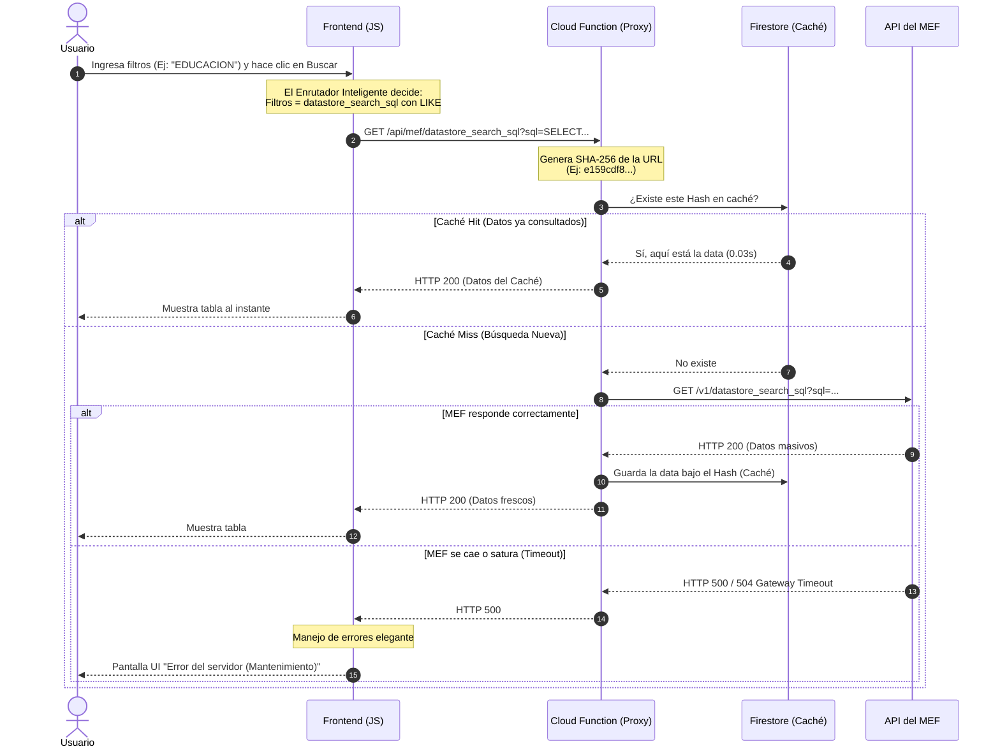

# Arquitectura y Diseño Técnico de ExpedienteCheck

Este documento detalla la arquitectura de software, infraestructura y flujos de datos diseñados para la aplicación ExpedienteCheck. El diseño está pensado para soportar el alto volumen de datos del MEF (más de 11 millones de registros) garantizando estabilidad, rapidez y escalabilidad.

---

## 1. Diagrama de Arquitectura General

El siguiente diagrama muestra los componentes principales del sistema y cómo interactúan desde que un usuario accede hasta que la infraestructura es provisionada.

```mermaid
graph TD
    %% Usuarios y Clientes
    User((Usuario Final))
    
    %% Nivel Frontend (Firebase Hosting)
    subgraph Frontend [Capa de Presentación / Cliente]
        Vite[Vite + Vanilla JS]
        Router[Enrutador Inteligente]
    end

    %% Nivel Proxy (Firebase Cloud Functions)
    subgraph Backend [Capa Intermedia / Proxy]
        Function(Cloud Function: mefProxy)
        Firestore[(Firestore Cache)]
    end

    %% Nivel Externo
    subgraph Externa [Proveedor Externo]
        MEF_API[API Datos Abiertos MEF<br/>CKAN]
    end

    %% Infraestructura y CI/CD
    subgraph Infra [Infraestructura / DevOps]
        TF{Terraform}
        GH[GitHub Actions CI/CD]
    end

    %% Relaciones
    User -->|Interactúa (Búsqueda/Filtro)| Vite
    Vite -->|Petición HTTP| Router
    Router -->|datastore_search| Function
    Router -->|datastore_search_sql| Function
    Function <-->|1. Verifica Hash URL| Firestore
    Function -->|2. Cache Miss (Petición HTTP)| MEF_API
    MEF_API -.->|Respuesta (Puede fallar 500/504)| Function
    Function -.->|3. Guarda data (Cache Hit)| Firestore
    
    %% Relaciones DevOps
    TF -.->|Aprovisiona| Firestore
    TF -.->|Aprovisiona| Function
    TF -.->|Aprovisiona| Vite
    GH -.->|Ejecuta Tests y Despliega| Frontend
    GH -.->|Ejecuta Tests y Despliega| Backend
    
    classDef frontend fill:#3b82f6,stroke:#1d4ed8,color:white;
    classDef backend fill:#f59e0b,stroke:#b45309,color:white;
    classDef external fill:#10b981,stroke:#047857,color:white;
    classDef infra fill:#6366f1,stroke:#4338ca,color:white;
    
    class Vite,Router frontend;
    class Function,Firestore backend;
    class MEF_API external;
    class TF,GH infra;
```

---

## 2. Flujo de Comunicación (Sequence Diagram)

Aquí se grafica exactamente qué ocurre paso a paso cuando un usuario hace una búsqueda o usa los filtros, y cómo la Caché nos salva de los errores del MEF.



---

## 3. Decisiones Arquitectónicas (A Detalle)

### A. Capa de Presentación (Vanilla JS + Vite)
- **Decisión:** Usar Vanilla JS estructurado en lugar de frameworks pesados (React/Vue).
- **Por qué:** Cumple con la necesidad de demostrar fundamentos limpios. Permite máxima ligereza en la carga inicial y demuestra sólidas bases algorítmicas para manipular el DOM directamente.
- **Técnicas aplicadas:**
  - *Debouncing* para no saturar el servidor al teclear.
  - Fallbacks (Valores estáticos en código) para poblar los selects, evitando colapsos del servidor MEF al solicitar listas únicas (`SELECT DISTINCT`) de tablas con millones de registros.

### B. Enrutador Inteligente (Smart Fetching)
- **Problema:** El API CKAN del MEF penaliza consultas pesadas. Múltiples filtros en el endpoint estándar devolvían `409 Conflict` o Timeout.
- **Solución:**
  - Si hay texto libre -> Endpoint `datastore_search` (usa el índice ultra rápido `_full_text` del motor PostgreSQL del MEF).
  - Si hay filtros condicionales -> Endpoint `datastore_search_sql` con operador `LIKE` para simular búsquedas menos estrictas y eludir los bloqueos internos de CKAN.

### C. Proxy & Caché Híbrida (Firestore + Cloud Functions)
- **Problema:** Los navegadores bloquean peticiones directas de otro dominio por seguridad (Error CORS). Además, el API MEF es altamente inestable.
- **Solución:** 
  1. La **Cloud Function** actúa como puente de backend para evitar los bloqueos CORS del navegador.
  2. Implementamos una base de datos **Firestore** como capa intermedia de caché. Cada URL consultada se cifra en un Hash SHA-256. El resultado se almacena íntegramente. Si el estado gubernamental colapsa, la aplicación sigue viva sirviendo la data previamente indexada a los usuarios.

### D. Automatización e Infraestructura (Terraform + GitHub Actions)
- **Terraform (IaC):** Toda la infraestructura en Google Cloud (APIs, cuentas de servicio) se declaró como código (`.tf`). Esto permite destruir y reconstruir un clon exacto de los servidores en segundos, separando entornos de `DEV` y `PROD`.
- **GitHub Actions (CI/CD):** Configuramos un flujo (`deploy.yml`) de integración continua. Cada vez que el desarrollador hace un `git push`, un servidor en la nube de GitHub clona el proyecto, instala Node, corre las pruebas automatizadas de Vite (`npm run test`), y solo si son exitosas, inyecta credenciales seguras (GitHub Secrets) para aprovisionarlo automáticamente a los servidores mundiales de Firebase.
