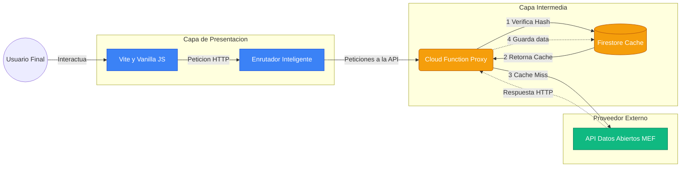
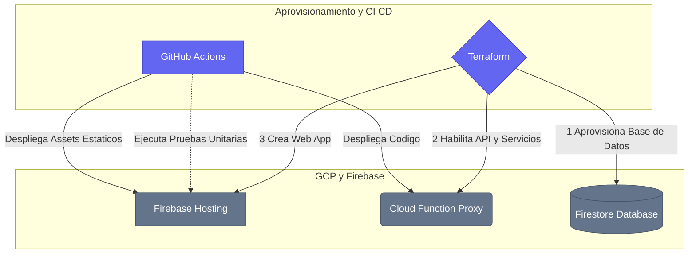
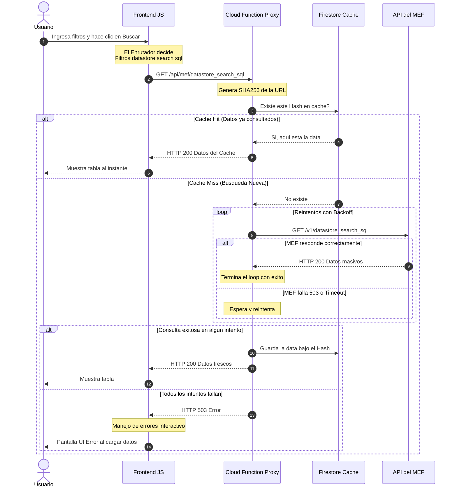

# Arquitectura y Diseño Técnico de ExpedienteCheck

Este documento detalla la arquitectura de software, infraestructura y flujos de datos diseñados para la aplicación ExpedienteCheck. El diseño está pensado para soportar el alto volumen de datos del MEF (más de 11 millones de registros) garantizando estabilidad, rapidez y escalabilidad.

---

## 1. Diagrama de Arquitectura General

El siguiente diagrama muestra los componentes principales del sistema y cómo interactúan desde que un usuario accede hasta que la infraestructura es provisionada.

### 1.1 Diagrama de Infraestructura y DevOps

Este diagrama muestra cómo se aprovisionan los componentes y cómo se despliega el código de manera automatizada.

---

## 2. Flujo de Comunicación (Sequence Diagram)

Aquí se grafica exactamente qué ocurre paso a paso cuando un usuario hace una búsqueda o usa los filtros, y cómo la Caché nos salva de los errores del MEF.

---

## 3. Decisiones Arquitectónicas (A Detalle)

### A. Capa de Presentación (Vanilla JS + Vite)
- **Decisión:** Usar Vanilla JS estructurado en lugar de frameworks pesados (React/Vue).
- **Por qué:** Cumple con la necesidad de demostrar fundamentos limpios. Permite máxima ligereza en la carga inicial y demuestra sólidas bases algorítmicas para manipular el DOM directamente.
- **Técnicas aplicadas:**
  - *Debouncing* para no saturar el servidor al teclear.
  - Fallbacks (Valores estáticos en código) para poblar los selects, evitando colapsos del servidor MEF al solicitar listas únicas (`SELECT DISTINCT`) de tablas con millones de registros.

### B. Enrutador Inteligente (Smart Fetching)
- **Problema:** El API CKAN del MEF penaliza consultas pesadas. Múltiples filtros en el endpoint estándar devolvían `409 Conflict` o Timeout.
- **Solución:**
  - Si hay texto libre -> Endpoint `datastore_search` (usa el índice ultra rápido `_full_text` del motor PostgreSQL del MEF).
  - Si hay filtros condicionales -> Endpoint `datastore_search_sql` con operador `LIKE` para simular búsquedas menos estrictas y eludir los bloqueos internos de CKAN.

### C. Proxy, Resiliencia & Caché Híbrida (Firestore + Cloud Functions + RAM Client)
- **Problema:** Los navegadores bloquean peticiones directas de otro dominio por seguridad (Error CORS). Además, el API MEF es altamente inestable (503s frecuentes) y lenta.
- **Solución:** 
  1. La **Cloud Function** actúa como puente de backend para evitar los bloqueos CORS del navegador y expone endpoints filtrados por seguridad.
  2. **Estrategia de Reintentos (Backend):** Implementamos un wrapper de reintentos automáticos con backoff exponencial. Si el MEF lanza un 503, la Cloud Function reintenta silenciosamente hasta 3 veces antes de fallar.
  3. **Caché en Base de Datos (Nivel 2):** Implementamos una base de datos **Firestore** como capa intermedia de caché en el servidor. Cada URL se cifra en un Hash SHA-256, almacenando el resultado por 24 horas.
  4. **Caché en Memoria (Nivel 1):** El frontend implementa un mapa en memoria RAM local para almacenar tanto los resultados de la tabla como los cálculos consolidados del Dashboard de BI, reduciendo las llamadas de red redundantes en <1ms al cambiar de pestaña.
  5. **Evasión de AdBlockers:** Excluimos el uso del SDK de Firestore para el flujo de caché en el cliente (que suele ser bloqueado por AdBlockers), delegando esa comunicación a través del canal HTTP seguro de la Cloud Function.

### D. Automatización e Infraestructura (Terraform + GitHub Actions)
- **Terraform (IaC):** Toda la infraestructura en Google Cloud (APIs, cuentas de servicio) se declaró como código (`.tf`). Esto permite destruir y reconstruir un clon exacto de los servidores en segundos, separando entornos de `DEV` y `PROD`.
- **GitHub Actions (CI/CD):** Configuramos un flujo (`deploy.yml`) de integración continua. Cada vez que el desarrollador hace un `git push`, un servidor en la nube de GitHub clona el proyecto, instala Node, corre las pruebas automatizadas de Vite (`npm run test`), y solo si son exitosas, inyecta credenciales seguras (GitHub Secrets) para aprovisionarlo automáticamente a los servidores mundiales de Firebase.
